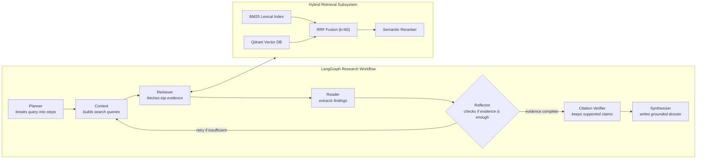

# ✦ Karpathy — LangGraph Agentic Deep Research Console

> **Autonomous Multi-Agent Literature Synthesis & Hybrid Retrieval Intelligence Engine**

**Karpathy** is an agentic deep research system designed to autonomously explore, critique, synthesize, and cite academic literature across arXiv, CrossRef, Semantic Scholar, Wikipedia, and the web. Built on **LangGraph's stateful cyclic workflow** and powered by a high-precision **Hybrid Retrieval Subsystem** (BM25 + Qdrant + RRF + Semantic Reranker).

---

## 🏛️ System Architecture



---

## ⚡ Core Subsystems

### 1. LangGraph Research Workflow
- **`Planner`**: Decomposes complex research queries into structured sub-goals (Taxonomy/Survey, Mechanisms/Benchmarks, Open Problems).
- **`Context`**: Formulates targeted keyword-rich and semantic academic search queries.
- **`Retriever`**: Orchestrates live multi-source paper acquisition and invokes the Hybrid Retrieval Subsystem.
- **`Reader`**: Extracts technical findings, loss functions, metrics, and dates from reranked passages.
- **`Reflector`**: Evaluates evidence sufficiency and manages conditional loopbacks (*"retry if evidence is insufficient"*).
- **`Citation Verifier`**: Deterministically verifies claims against retrieved chunks and aligns citation tags (`[source_id]`).
- **`Synthesizer`**: Compiles publication-grade Research Dossiers with structured Markdown and HTML visualizations.

### 2. Hybrid Retrieval Subsystem
- **BM25 Lexical Search** (`rank-bm25`): Exact keyword matching and term frequency scoring.
- **Qdrant Vector Index** (`qdrant-client`): In-memory dense vector database with 384-dimensional cosine embeddings.
- **Reciprocal Rank Fusion (RRF)**: Merges dense and sparse ranks with standard $k=60$:
  $$\text{RRF Score}(d) = \sum_{m \in \{\text{BM25}, \text{Qdrant}\}} \frac{1}{60 + \text{rank}_m(d)}$$
- **Semantic Reranking**: Re-scores top fused passages based on semantic overlap and publication recency.

### 3. Multi-Source Literature Discovery
- **arXiv API**: Recent preprints, short IDs, abstracts, and publication dates.
- **CrossRef API**: Peer-reviewed journal publications, DOIs, and journal containers.
- **Semantic Scholar API**: Academic graph queries, author metrics, and citation links.
- **Wikipedia Summary API**: Foundational taxonomy and domain overview context.
- **Web Search Engine**: Fast supplementary articles and web literature.

---

## 📑 Research Dossier Output Format

Every research response generated by the engine includes:
1. **📚 Indexed Sources Grid**: Numbered interactive cards of all sources analyzed, with year badges and direct paper links.
2. **🔍 Survey & Foundation**: Deep synthesis of foundational taxonomy, milestones, and theoretical paradigms.
3. **📅 Chronological Research Timeline**: Year-by-year evolution of the domain with core mechanisms and empirical findings.
4. **🤖 SOTA Models & Benchmark Comparison**: A comprehensive Markdown comparison table alongside detailed model cards.
5. **🔬 Frontier, Failure Modes & Open Problems**: Analysis of critical vulnerabilities, alignment failures, and open questions.
6. **💡 Key Takeaways & Synthesis**: High-impact actionable takeaways with inline citations (`[source_id]`).

---

## 🚀 Quickstart

### 1. Environment Setup
Clone the repository and install dependencies:
```bash
git clone https://github.com/GovindUpadhyay13/Agentic_deep_reseacher.git
cd Agentic_deep_reseacher
pip install -r requirements.txt
```

Create a `.env` file in the root directory:
```env
GEMINI_API_KEY=your_gemini_api_key_here
```

### 2. Launch Interactive Console (Perplexity-Style UI)
```bash
streamlit run src/app.py
```
Open **[http://localhost:8501](http://localhost:8501)** in your browser to experience live LangGraph research streaming.

### 3. Run Pipeline Scripts

**Windows (PowerShell):**
```powershell
.\run.ps1
```

**Linux / macOS:**
```bash
chmod +x run.sh
./run.sh
```

---

## 📂 Repository Structure

```text
.
├── src/
│   ├── app.py                 # Streamlit Perplexity-style interactive console
│   ├── hybrid_retriever.py    # BM25 + Qdrant + RRF + Semantic Reranker subsystem
│   ├── phase1_index.py        # arXiv scraper & ChromaDB persistent indexer
│   ├── phase2_agent.py        # LangGraph StateGraph (Planner, Reflector, Verifier)
│   └── phase3_eval.py         # Evaluation & ablation runner
├── eval/
│   └── questions.jsonl        # Benchmark evaluation prompts
├── predictions/               # Output JSONL predictions for evaluation
├── run.ps1                    # Windows PowerShell master execution script
├── run.sh                     # Linux/macOS master execution script
├── requirements.txt           # Python dependencies
└── README.md                  # Project documentation
```

---

## 📜 License
MIT License
